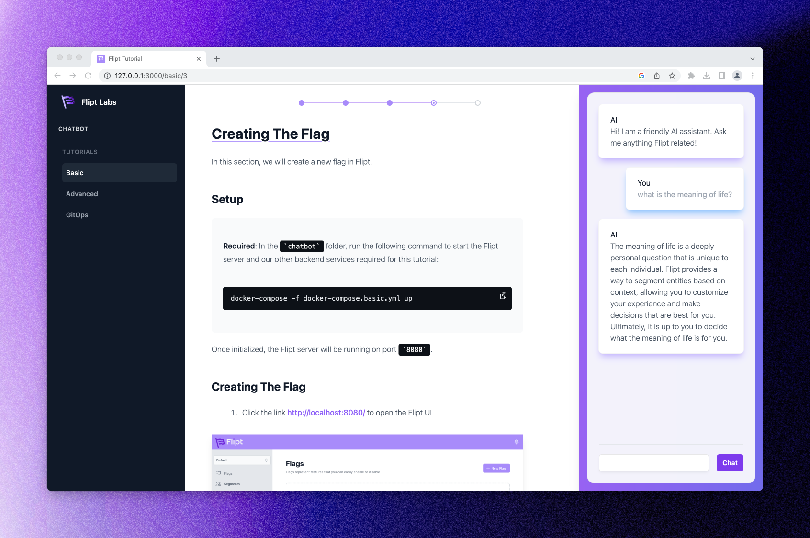

# Flipt Chatbot

## Overview

This application is designed to be a set of interactive tutorials on how to use Flipt. It is intended to be both a learning tool and a reference implementation for how to use Flipt in a real application.

In particular, this application demonstrates how to use Flipt to:

- Use a simple feature flag to control the availability of the chatbot.
- Use segmentation to determine which sentiment or persona the chatbot should use based on the user's username.
- Use Git as a source of truth and leveraging GitOps for feature flag data showing how to use Flipt without a UI.

The chatbot is designed to answer questions about Flipt. If you enable OpenAI support, by setting the `OPENAI_API_KEY` environment variable, you will get much better answers as the chatbot will use the OpenAI API to generate answers that are based on our live documentation (<https://flipt.io/docs>)

If you don't have an OpenAI API key, you can still use the chatbot, but the answers will be much more limited as they are based on a static set of answers that are included in the application.

## Prerequisites

- [Node.js](https://nodejs.org/en/download/) (v16 or higher)
- [Docker](https://docs.docker.com/get-docker/)
- [Docker Compose](https://docs.docker.com/compose/install/)
- `OPENAI_API_KEY` environment variable set to your OpenAI API key. You can get one [here](https://beta.openai.com/). (optional)

## Usage

1. Clone this repository
1. `cd` into this directory (e.g. `cd chatbot`)
1. Run `./scripts/start`
1. Open <http://localhost:3000> in your browser if it doesn't open automatically
1. Start with the 'Basic' tutorial, then move on to the 'Advanced' tutorial, etc

## Architecture

TODO

## Troubleshooting

If you run into any issues, please [open an issue](https://github.com/flipt-io/labs/issues/new&labels=chatbot) and we'll get back to you as soon as we can.
